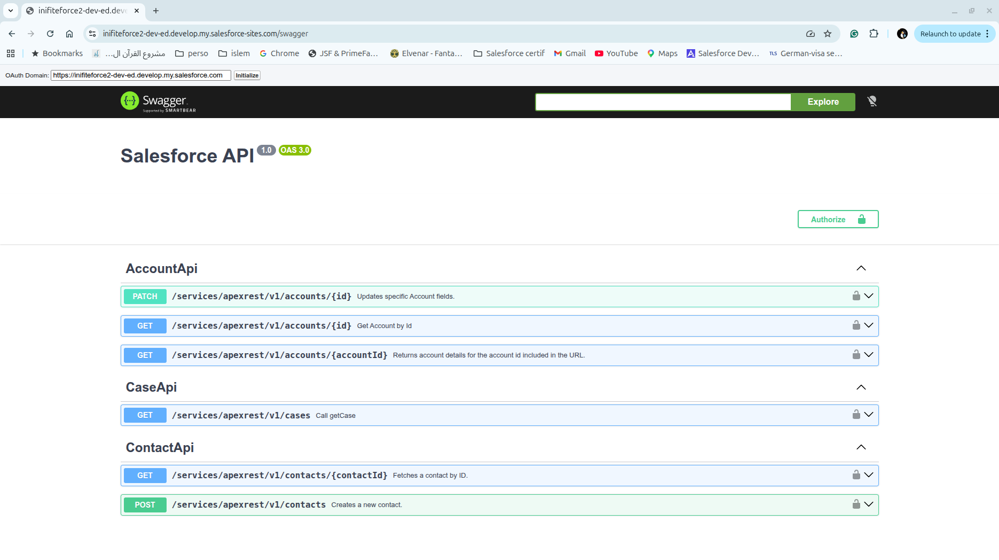
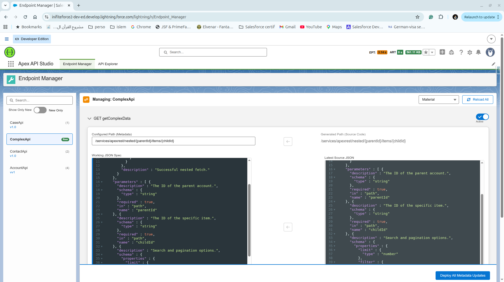

# force-openapi-toolkit

A Salesforce-native toolkit that discovers Apex REST endpoints and generates OpenAPI (Swagger) specifications from Apex source and structured ApexDoc comments. Includes an Admin Lightning App for discover → generate → compare → publish, and an optional public Swagger UI for external consumers.

---

## Table of Contents

- [Key Features](#key-features)
- [Prerequisites](#prerequisites)
- [Installation](#installation)
- [End-to-End Usage Guide](#end-to-end-usage-guide)
  - [Step 1 — Annotate your Apex REST classes](#step-1--annotate-your-apex-rest-classes)
  - [Step 2 — Deploy the toolkit](#step-2--deploy-the-toolkit)
  - [Step 3 — Configure CORS (required)](#step-3--configure-cors-required)
  - [Step 4 — Open Apex API Studio](#step-4--open-apex-api-studio)
  - [Step 5 — Discover and select an endpoint](#step-5--discover-and-select-an-endpoint)
  - [Step 6 — Review, edit and publish endpoint configs](#step-6--review-edit-and-publish-endpoint-configs)
  - [Step 7 — View the public Swagger UI](#step-7--view-the-public-swagger-ui)
- [ApexDoc Tag Reference](#apexdoc-tag-reference)
- [Endpoint Configuration Options Reference](#endpoint-configuration-options-reference)
- [Custom Metadata Object Reference — `OpenApi_Endpoint__mdt`](#custom-metadata-object-reference--openapi_endpointmdt)
- [Component Architecture](#component-architecture)
  - [Apex Classes](#apex-classes)
  - [Lightning Web Components](#lightning-web-components)
  - [Visualforce Pages](#visualforce-pages)
  - [Custom Metadata Type](#custom-metadata-type)
- [Apex Sample Snippets](#apex-sample-snippets)
- [npm Scripts Reference](#npm-scripts-reference)
- [Contributing](#contributing)
- [License](#license)

---

## Key Features

- Auto-discovery of all `@RestResource` Apex classes and their HTTP methods via the Tooling API
- OpenAPI 3.0 spec generation from ApexDoc comments (operations, parameters, responses)
- Admin Lightning App: **discover → generate → preview → compare → publish** in one place
- In-app JSON editor (CodeMirror) with syntax highlighting, linting, bracket matching, and code folding
- **Auto Sync** mode: spec is always re-generated from source code at runtime — no manual editing needed
- Path and spec diff indicators between the stored metadata and the current source
- Public Swagger UI via Visualforce page or Salesforce Site, with Bearer token and OAuth 2.0 support
- Deploy scripts: `npm run deploy:core | deploy:samples | deploy:all`

---

## Prerequisites

| Requirement | Version |
|---|---|
| Node.js | >= 18 |
| Salesforce CLI (`sf`) | Latest |
| Authenticated Salesforce org | Any sandbox or scratch org |

---

## Installation

```bash
# 1. Clone and install dependencies
git clone https://github.com/alMo2nes/force-openapi-toolkit.git
cd force-openapi-toolkit
npm install

# 2. Deploy everything (toolkit + sample REST classes)
npm run deploy:all -- -o <your-org-alias>

# 3. Deploy only the toolkit (no samples)
npm run deploy:core -- -o <your-org-alias>

# 4. Deploy only the sample REST classes
npm run deploy:samples -- -o <your-org-alias>
```

---

## End-to-End Usage Guide

### Step 1 — Annotate your Apex REST classes

Add ApexDoc comments above each HTTP method you want documented. The toolkit reads these at runtime to build the OpenAPI spec. See the [ApexDoc Tag Reference](#apexdoc-tag-reference) for all supported tags.

```apex
@RestResource(urlMapping='/v1/accounts/*')
global with sharing class AccountApi {

    /**
     * @description Retrieve an Account by ID
     * @param {String} id [path] [required] Salesforce Account ID
     * @response {200} {Account} Account returned successfully
     * @response {404} {} Account not found
     * @response {400} {} Invalid or missing ID
     */
    @HttpGet
    global static Account getAccount() {
        RestRequest req = RestContext.request;
        RestResponse res = RestContext.response;
        res.addHeader('Content-Type', 'application/json; charset=UTF-8');
        String id = req.requestURI.substringAfterLast('/').trim();
        if (String.isBlank(id)) {
            res.statusCode = 400;
            res.responseBody = Blob.valueOf('{"error":"Account Id required"}');
            return null;
        }
        List<Account> a = [SELECT Id, Name, Industry FROM Account WHERE Id = :id WITH USER_MODE LIMIT 1];
        if (a.isEmpty()) { res.statusCode = 404; return null; }
        res.statusCode = 200;
        return a[0];
    }
}
```

### Step 2 — Deploy the toolkit

Run the deploy command from [Installation](#installation). This deploys all Apex classes, LWC components, custom metadata, the Lightning App, and the Visualforce pages.

### Step 3 — Configure CORS (required)

The embedded Swagger UI makes cross-origin requests to the org's OAuth endpoints. Without this setting, the interactive **Try it out** feature will not work.

1. Go to **Setup → Quick Find → CORS**
2. Click **Edit** in the _Cross-Origin Resource Sharing (CORS) Policy Settings_ section
3. Check **Enable CORS for OAuth endpoints**
4. Click **Save**

If you plan to expose the Swagger UI via a Salesforce Site, also add a CORS Allowlist entry for your site's origin.

### Step 4 — Open Apex API Studio

1. Click the App Launcher (nine dots) in the top navigation bar
2. Search for **Apex API Studio** and open it
3. The app opens with a two-panel layout:
   - **Left panel** — API Sidebar listing all discovered `@RestResource` classes
   - **Right panel** — API Endpoint Manager for the selected class

### Step 5 — Discover and select an endpoint

The sidebar loads automatically by querying the Tooling API for all classes annotated with `@RestResource`.

| Sidebar element | Description |
|---|---|
| **Search box** | Filter classes by name (case-insensitive) |
| **New Only toggle** | Show only classes that have no published config yet |
| **Class name row** | Click to load the endpoint manager for that class |
| **Green "New" badge** | The class has no stored `OpenApi_Endpoint__mdt` record |
| **(N) count** | The class has N published endpoint configs |
| **v{version}** | The latest published version for that class |

### Step 6 — Review, edit and publish endpoint configs

After selecting a class the right panel loads one accordion section per HTTP method found in that class.

#### Section header controls

| Control | Description |
|---|---|
| **Auto Sync toggle** | When ON, the spec and path are generated live from source code and are read-only. When OFF, you edit them manually. |
| **Deprecated toggle** | Marks the operation as deprecated in the generated OpenAPI spec. |
| **Active toggle** | Controls whether this endpoint appears in the Swagger UI. Inactive endpoints are hidden from the public spec. |

#### Inside each accordion section

| Field / Button | Description |
|---|---|
| **Path** | The full REST path for this operation (e.g. `/services/apexrest/v1/accounts/{id}`). Auto-populated from the `@RestResource` URL mapping and any `@path` or `[path]` parameter tags. Editable when Auto Sync is OFF. |
| **Reset Path to Generated** | Resets the path to the value generated from source. Disabled if they already match. |
| **Working JSON Spec editor** | CodeMirror editor showing the current OpenAPI operation object in JSON. Supports syntax highlighting, linting, bracket matching, folding, and keyword autocomplete. |
| **Lint JSON** | Validates the JSON in the editor and shows a success or error toast. |
| **Reset Spec to Generated** | Replaces the editor content with the spec generated from source. Disabled if they already match. |
| **View Generated Spec** | Opens a read-only modal showing exactly what the generator would produce from the current Apex source code. Useful for comparing with your customized version. |
| **Version** | Semantic version string for this endpoint config (e.g. `1.0`, `2.1`). Becomes part of the metadata record's Developer Name. |
| **Editor Theme selector** | Switch the CodeMirror theme: Dracula, Material, Monokai, or Default. Applies to all open editors simultaneously. |
| **Reload All** | Refreshes all configs for the selected class from the server. |

#### Saving and deploying

Click **Deploy All Metadata Updates** at the bottom of the panel. This:

1. Validates all JSON specs in the editors
2. Packages every accordion section into a `Metadata.DeployContainer`
3. Enqueues an async metadata deployment
4. Polls the deployment status every 2 seconds
5. Shows a success toast and refreshes the sidebar when deployment completes

The metadata record `DeveloperName` is built as `{ClassName}_{MethodName}_{Version}` (non-alphanumeric characters in version are replaced with underscores).

### Step 7 — View the public Swagger UI

After publishing at least one active endpoint config, open the Swagger UI:

**Via internal Visualforce page:**
```
https://<your-org-domain>/apex/swagger_ui
```

**Via Salesforce Site** (for external consumers):
Set up a public Salesforce Site pointing to the `swagger_ui` page and configure Guest User access as needed.

The Swagger UI page:
- Renders the full OpenAPI 3.0 spec assembled from all active `OpenApi_Endpoint__mdt` records
- For authenticated internal users, pre-populates the Bearer token with the current session ID so **Try it out** works immediately
- For guest/public users, the Bearer token is empty; users must supply an OAuth token manually
- Supports both **Bearer token** and **Salesforce OAuth 2.0 Authorization Code** authentication flows

---

## ApexDoc Tag Reference

Place a `/** ... */` block directly above the method declaration (before the `@HttpGet` / `@HttpPost` etc. annotation line).

| Tag | Syntax | Description |
|---|---|---|
| `@description` | `@description <text>` | Sets the operation's `summary` field in the OpenAPI spec. Defaults to `Call <methodName>` if omitted. |
| `@path` | `@path <path>` | Overrides the auto-generated path. Can be a full path (starting with `/services/apexrest/`) or a relative segment. Useful when the `@RestResource` URL mapping is too generic. |
| `@param` | `@param {Type} name [flags] Description` | Documents a parameter. See flags table below. |
| `@response` | `@response {Code} {Type} Description` | Documents a response. `Code` is the HTTP status code (e.g. `200`, `404`). `Type` is the Apex return type (optional). |

**`@param` flags** (include in square brackets, any order):

| Flag | Effect |
|---|---|
| `[path]` | Parameter is a path segment (e.g. `{id}`). Also sets required = true automatically. |
| `[query]` | Parameter is a query string parameter. |
| `[required]` | Marks the parameter as required in the spec without affecting its location. |

**Type syntax in `@param` and `@response`:**

| Apex type | Example | Generates |
|---|---|---|
| Primitive | `{String}`, `{Integer}`, `{Boolean}` | Scalar schema |
| SObject | `{Account}` | `object` schema with description `Apex: Account` |
| List / Set | `{List<Account>}` | Array schema with items |
| Inline object | `{filter: string, limit: integer}` | Object schema with named properties |

---

## Endpoint Configuration Options Reference

These are the settings available per endpoint in the Admin App and how they map to the `OpenApi_Endpoint__mdt` fields.

| UI Label | MDT Field | Type | Description |
|---|---|---|---|
| **Auto Sync** | `Auto_Sync_Spec__c` | Checkbox | When enabled, the spec and path stored in metadata are ignored at render time. The Swagger UI assembles the spec by calling `EndpointConfigGenerator` at runtime. Changes to ApexDoc comments are reflected immediately without re-deploying. |
| **Active** | `Active__c` | Checkbox | Controls visibility in the public Swagger UI. Inactive endpoints are excluded from the generated spec entirely. Defaults to `true` for new endpoints. |
| **Deprecated** | `Deprecated__c` | Checkbox | Adds `"deprecated": true` to the OpenAPI operation object. Swagger UI renders deprecated operations with a strikethrough badge. |
| **Path** | `Path__c` | Text (255) | The full REST path for the operation. Auto-derived from `@RestResource(urlMapping)` plus any `@path` or `[path]` parameter tags. Editable when Auto Sync is OFF. |
| **Working JSON Spec** | `Spec__c` | Long Text Area (32 768) | The full OpenAPI operation object in JSON. Stored when Auto Sync is OFF. When Auto Sync is ON this field is left blank and the spec is generated at runtime. |
| **Version** | `Version__c` | Text (50) | Semantic version string. Becomes part of the metadata record Developer Name. Increment this when publishing a breaking change to the same endpoint. |

---

## Custom Metadata Object Reference — `OpenApi_Endpoint__mdt`

Each published endpoint maps to one record of the custom metadata type `OpenApi_Endpoint__mdt`.

| API Name | Label | Type | Max Length | Required | Description |
|---|---|---|---|---|---|
| `Class_Name__c` | Class Name | Text | 100 | Yes | The Apex class name that owns the endpoint (e.g. `AccountApi`). |
| `Method_Name__c` | Method Name | Text | 255 | No | The Apex method name within the class (e.g. `getAccount`). Used for Auto Sync lookups. |
| `Http_Method__c` | HTTP Method | Picklist | — | No | One of: `GET`, `POST`, `PUT`, `PATCH`, `DELETE`. |
| `Path__c` | Path | Text | 255 | No | Full REST path (e.g. `/services/apexrest/v1/accounts/{id}`). Ignored when `Auto_Sync_Spec__c` is true. |
| `Spec__c` | OpenAPI Spec (JSON/YAML) | Long Text Area | 32 768 | No | The OpenAPI operation object in JSON. Ignored when `Auto_Sync_Spec__c` is true. |
| `Version__c` | Version | Text | 50 | No | Version string (e.g. `1.0`). |
| `Active__c` | Active | Checkbox | — | No | When false, the endpoint is excluded from the public Swagger UI. |
| `Deprecated__c` | Deprecated | Checkbox | — | No | When true, `"deprecated": true` is added to the operation in the spec. |
| `Auto_Sync_Spec__c` | Auto Sync Spec from Code | Checkbox | — | No | When true, spec and path are generated at runtime from source code. `Spec__c` and `Path__c` are not stored. |

The metadata record Developer Name follows the pattern: `{ClassName}_{MethodName}_{Version}` where non-alphanumeric characters in the version are replaced with underscores.

---

## Component Architecture

### Apex Classes

| Class | Role |
|---|---|
| `RestEndpointInspector` | Discovers all `@RestResource` classes via the Tooling API (SOSL + SOQL), parses Apex source bodies to extract `SymbolTable` method metadata, and parses ApexDoc comments into structured descriptors. |
| `EndpointConfigGenerator` | Builds OpenAPI operation objects and full path strings from `RestEndpointInspector` output. Used by both the Admin App (preview) and the Swagger UI (Auto Sync rendering). |
| `OpenApiManagerController` | AuraEnabled backend for the Admin App. Provides sidebar items, config comparisons (source vs stored), metadata deployment via `Metadata.Operations.enqueueDeployment`, and deployment status polling via the Tooling API. |
| `SwaggerUIController` | Visualforce page controller. Assembles the full OpenAPI 3.0 spec from all active `OpenApi_Endpoint__mdt` records, resolves Auto Sync entries at render time, and exposes the org domain and session token to the page. |
| `SessionService` | Provides an elevated session ID via the `SessionBridge` Visualforce page to allow Apex running in LWC context to call the Tooling API. |

### Lightning Web Components

| Component | Role |
|---|---|
| `apiSidebar` | Left panel of the Admin App. Loads all discovered `@RestResource` classes, shows badges for new vs configured endpoints, and publishes the selected class via `ApiSelected__c` Lightning Message Channel. Supports search and "New Only" filter. |
| `openApiConfigManager` | Right panel of the Admin App. Subscribes to the `ApiSelected__c` message, loads and displays per-method endpoint configs with CodeMirror editors, handles all editing operations, and triggers metadata deployment. Subscribes to `ApiStudioEvents__c` to refresh the sidebar after deploy. |

### Visualforce Pages

| Page | Role |
|---|---|
| `swagger_ui` | Renders the embedded Swagger UI (loaded from a Static Resource). Driven by `SwaggerUIController` which builds the full spec and provides the session token. Suitable for internal org access or Salesforce Sites. |
| `SessionBridge` | Internal bridge page that returns the elevated session ID. Queried by `SessionService` so Apex code running in the LWC security context can call the Tooling API. |
| `OAuthRedirect` | Handles OAuth redirect callbacks for the Swagger UI interactive authentication flow. |

### Custom Metadata Type

`OpenApi_Endpoint__mdt` — stores the published OpenAPI config for each Apex REST method. See the [Custom Metadata Object Reference](#custom-metadata-object-reference--openapi_endpointmdt) section for the full field list.

---

## Apex Sample Snippets

The `force-app-samples` directory contains ready-to-deploy REST classes demonstrating all annotation patterns:

**Simple GET with path parameter** (`AccountApi`):
```apex
@RestResource(urlMapping='/v1/accounts/*')
global with sharing class AccountApi {

    /**
     * @description Retrieve an Account by ID
     * @param {String} id [path] [required] Salesforce Account ID
     * @response {200} {Account} Account returned successfully
     * @response {404} {} Account not found
     * @response {400} {} Invalid ID
     */
    @HttpGet
    global static Account getAccount() {
        RestRequest req = RestContext.request;
        RestResponse res = RestContext.response;
        res.addHeader('Content-Type', 'application/json; charset=UTF-8');
        String id = req.requestURI.substringAfterLast('/').trim();
        if (String.isBlank(id) || !isValidSalesforceId(id)) {
            res.statusCode = 400;
            res.responseBody = Blob.valueOf('{"error":"Account Id required"}');
            return null;
        }
        List<Account> a = [SELECT Id, Name, Industry FROM Account WHERE Id = :id WITH USER_MODE LIMIT 1];
        if (a.isEmpty()) { res.statusCode = 404; return null; }
        res.statusCode = 200;
        return a[0];
    }
}
```

**`@path` override with nested path and query parameters** (`ComplexApi`):
```apex
@RestResource(urlMapping='/v1/complex/*')
global with sharing class ComplexApi {

    /**
     * @description Fetch nested resource with filter options
     * @path /nested/{parentId}/items/{childId}
     * @param {String} parentId [path] Parent resource ID
     * @param {String} childId [path] Child resource ID
     * @param {filter: string, limit: integer} options [query] Filter options
     * @response {200} {Account} Mock response
     */
    @HttpGet
    global static Account getComplexData() {
        return new Account(Name = 'Complex Mock');
    }
}
```

---

## npm Scripts Reference

| Script | Command | Description |
|---|---|---|
| `deploy:all` | `sf project deploy start` | Deploys all source directories |
| `deploy:core` | `sf project deploy start --source-dir force-app` | Deploys only the toolkit (no sample classes) |
| `deploy:samples` | `sf project deploy start --source-dir force-app-samples` | Deploys only the sample REST classes |
| `lint` | `eslint "**/{aura,lwc}/**/*.js"` | Lints all LWC JavaScript files |
| `format` | `prettier --write "**/*.{cls,html,js,...}"` | Formats all source files with Prettier |
| `test` / `test:unit` | `sfdx-lwc-jest` | Runs LWC unit tests |
| `test:unit:coverage` | `sfdx-lwc-jest --coverage` | Runs LWC unit tests with coverage report |

Pass `-- -o <org-alias>` to any deploy script to target a specific org. Example:

```bash
npm run deploy:all -- -o my-scratch-org
```

---

## Contributing

Fork → branch → PR. Include or adjust unit tests when changing parsing or generation logic.

---

## License & Support

- **License:** MIT (see LICENSE)
- **Support:** Open an issue at https://github.com/alMo2nes/force-openapi-toolkit/issues

---

## Screenshots


*Swagger UI exposed via Salesforce Site (public explorer).*


*Lightning App used by administrators to discover endpoints and generate OpenAPI descriptions.*
