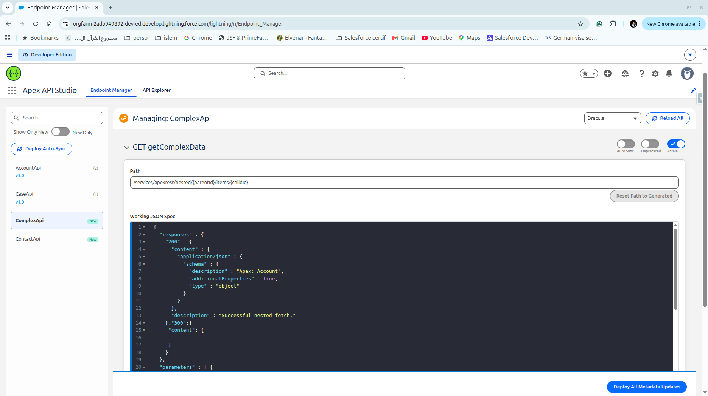
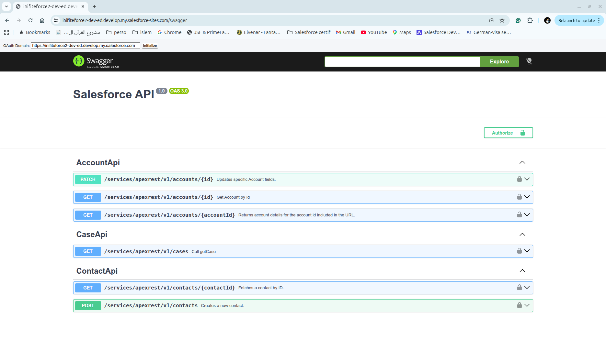
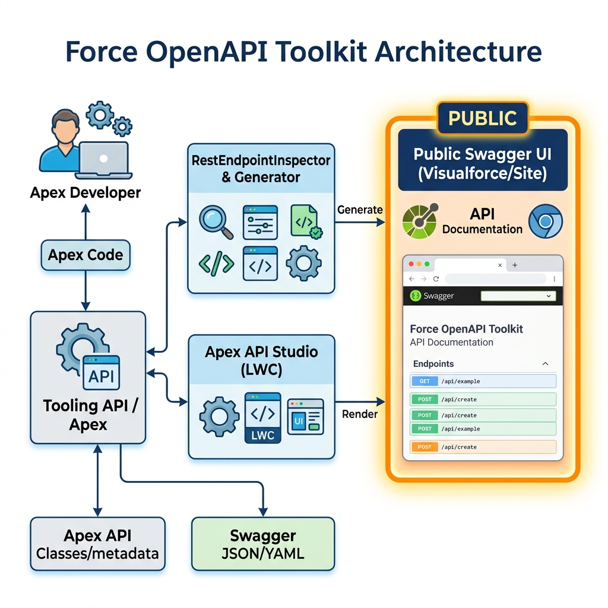

# force-openapi-toolkit


---

A Salesforce-native framework for discovering Apex REST services, generating OpenAPI 3.0 specifications, managing versioned API definitions, and publishing interactive Swagger UI documentation directly from Salesforce.

**Force OpenAPI Toolkit** helps Salesforce teams expose APIs with professional documentation, directly in Salesforce, without maintaining external API documentation platforms.

## 📸 Screenshots

|           **Apex API Studio (Lightning Admin App)**            |                     **Public Swagger UI (Visualforce / Site)**                     |
| :------------------------------------------------------------: | :--------------------------------------------------------------------------------: |
|                      |                                              |
| _Discover endpoints, edit OpenAPI specs, and deploy metadata._ | _Interactive OpenAPI 3.0 explorer with Try‑It‑Out, Bearer, and OAuth 2.0 support._ |

---

## 📋 Table of Contents

- [Key Features](#-key-features)
- [Architecture Flow Diagram](#-architecture-flow-diagram)
- [Prerequisites](#-prerequisites)
- [Installation & Deployment](#-installation--deployment)
- [ApexDoc Annotation Guide](#-apexdoc-annotation-guide)
- [End‑to‑End Usage Guide](#-end-to-end-usage-guide)
  - [Step 1 – Annotate your Apex REST classes](#step-1--annotate-your-apex-rest-classes)
  - [Step 2 – Deploy the toolkit](#step-2--deploy-the-toolkit)
  - [Step 3 – Configure CORS (required)](#step-3--configure-cors-required)
  - [Step 4 – Assign Permission Sets](#step-4--assign-permission-sets)
  - [Step 5 – Open Apex API Studio](#step-5--open-apex-api-studio)
  - [Step 6 – Review, edit, and publish configs](#step-6--review-edit-and-publish-configs)
  - [Step 7 – View the public Swagger UI](#step-7--view-the-public-swagger-ui)
- [Public Swagger UI & OAuth Configuration](#-public-swagger-ui--oauth-configuration)
- [Configuration Options & Custom Metadata](#-configuration-options--custom-metadata)
- [Component Inventory](#-component-inventory)
- [Scripts Reference](#-npm-scripts-reference)
- [Contributing & License](#-contributing--license)

---

## ✨ Key Features

- **Automatic REST Endpoint Discovery** – Scans all `@RestResource` Apex classes via the Tooling API.
- **ApexDoc Spec Generation** – Builds OpenAPI 3.0 specs from inline doc comments.
- **Apex API Studio Admin App** – Lightning Web Component UI for discover → preview → edit → diff → publish.
- **In‑App JSON Editor (CodeMirror)** – Syntax‑highlighted, linted, themeable editor.
- **Dynamic Auto‑Sync Mode** – Specs stay up‑to‑date with source code changes.
- **OpenAPI Spec intellisence** – Auto complete and validation while editing the OpenApi spec.
- **Embedded Swagger UI** – Visualforce page & Site support with interactive _Try It Out_, Bearer, and OAuth 2.0 (PKCE) flows.

---

## 🏗️ Architecture Flow Diagram

## 

## ⚙️ Prerequisites

| Requirement               | Minimum Version | Notes                                              |
| ------------------------- | --------------- | -------------------------------------------------- |
| **Node.js**               | `>= 18`         | Required for deploy scripts and formatting         |
| **Salesforce CLI (`sf`)** | Latest          | Required for metadata deployment                   |
| **Authenticated Org**     | Any             | Developer org, Scratch org, Sandbox, or Production |

> [!IMPORTANT]
> **CORS Configuration Required for "Try It Out"**
> The embedded Swagger UI makes cross‑origin API calls to your org. You **must** enable CORS for OAuth endpoints in Salesforce Setup for interactive testing to work. See [Step 3](#step-3--configure-cors-required).

---

## 🚀 Installation & Deployment

### Option A – Install Unlocked Package (Recommended)

Install the core package directly into your org using the package ID **`04tg5000000BdkPAAS`**.

[](https://login.salesforce.com/packaging/installPackage.apexp?p0=04tg5000000BdkPAAS)
[](https://test.salesforce.com/packaging/installPackage.apexp?p0=04tg5000000BdkPAAS)

```bash
sf package install --package 04tg5000000BdkPAAS --target-org <your-org-alias> --wait 10
```

### Option B – Deploy Source via Salesforce CLI

```bash
# Clone the repo and install dependencies
git clone https://github.com/alMo2nes/force-openapi-toolkit.git
cd force-openapi-toolkit
npm install

# Deploy the full toolkit + sample endpoints
npm run deploy:all -- -o <your-org-alias>

# Or deploy only the core toolkit (no samples)
npm run deploy:core -- -o <your-org-alias>
```

---

## 📖 ApexDoc Annotation Guide

Annotate your `@RestResource` methods with `/** … */` block comments directly above the HTTP verb annotation.

### Complete Apex REST Example

```apex
@RestResource(urlMapping='/v1/accounts/*')
global with sharing class AccountApi {
  /**
   * @description Retrieve an Account record by ID
   * @path /v1/accounts/{id}
   * @param {String} id [path] [required] Salesforce Account ID
   * @response {200} {Account} Account retrieved successfully
   * @response {400} {} Invalid or missing Account ID
   * @response {404} {} Account record not found
   */
  @HttpGet
  global static Account getAccount() {
    RestRequest req = RestContext.request;
    RestResponse res = RestContext.response;
    String id = req.requestURI.substringAfterLast('/').trim();
    if (String.isBlank(id)) {
      res.statusCode = 400;
      res.responseBody = Blob.valueOf('{"error":"Account ID is required"}');
      return null;
    }
    List<Account> accs = [
      SELECT Id, Name, Industry, Phone
      FROM Account
      WHERE Id = :id
      LIMIT 1
    ];
    if (accs.isEmpty()) {
      res.statusCode = 404;
      return null;
    }
    res.statusCode = 200;
    return accs[0];
  }

  /**
   * @description Create or update an Account record
   * @param {Account} body [required] Account details payload
   * @response {201} {Account} Account created successfully
   * @response {400} {} Bad request / missing payload
   */
  @HttpPost
  global static Account createAccount(String name, String industry) {
    Account acc = new Account(Name = name, Industry = industry);
    insert as user acc;
    RestContext.response.statusCode = 201;
    return acc;
  }
}
```

### Supported ApexDoc Tags

| Tag            | Syntax                                   | Description                               |
| -------------- | ---------------------------------------- | ----------------------------------------- |
| `@description` | `@description <text>`                    | Operation summary in OpenAPI spec         |
| `@path`        | `@path <path>`                           | Overrides auto‑generated path             |
| `@param`       | `@param {Type} name [flags] Description` | Documents query, path, or body parameters |
| `@response`    | `@response {Code} {Type} Description`    | Documents response codes and return types |

---

## 🛠️ End‑to‑End Usage Guide

### Step 1 – Annotate your Apex REST classes

(see the **ApexDoc Annotation Guide** above).

### Step 2 – Deploy the toolkit

Use **Option A** or **Option B** from the Installation section.

### Step 3 – Configure CORS (required)

In **Setup → Security → CORS**. Activate **Enable CORS for OAuth endpoints**

### Step 4 - Assign permission set to your user

- Assign the **Force OpenApi Toolkit Admin** permission set to your user to access the Apex API Studio.
- Assign the **Force OpenApi Toolkit Guest** permission set to your swagger site guest user to access the public Swagger UI.
- Or may run this anonymous Apex code to assign the right permission set to the guest user and all the admins:

```apex
new PostInstallHandler().onInstall(null);
```

### Step 5 – Open Apex API Studio

Navigate to **App Launcher → Apex API Studio**.

### Step 6 – Review, edit, and publish configs

- Use the **Endpoint Manager** to view discovered endpoints.
- Toggle **Auto‑Sync** to keep specs live, or use **Manual Edit** to update your endpoint spec.
- Use **Deploy All Metada** To store specs changes in `OpenApi_Endpoint__mdt`.
- Switch to **API Explorer** tab preview your changes and live preview the auto-sync APIs.
- Use **Deploy Auto Sync** to store the autogenerated spec of the auto-sync APIs in `OpenApi_Endpoint__mdt`.

### Step 6 – View the public Swagger UI

Access the Visualforce page **/apex/SwaggerExplorer** (or the associated Salesforce Site) to explore the generated OpenAPI spec.

---

## 🌐 Public Swagger UI & OAuth Configuration

> **IMPORTANT** – Authentication for the public Swagger UI can be set up via two secure methods:

1. **External Connected App (Recommended – PKCE)**
   - Create a **Connected App** in **Setup → Apps → External Client Apps → External Client App Manager**.
   - Enable **OAuth Settings** and check **Require Proof Key for Code Exchange (PKCE)**.
   - Set **Callback URL** to `https://<swagger‑site‑domain>/swagger/apex/OAuthRedirect`.
   - Select the required OAuth scopes `api`, `refresh_token`, `offline_access`
   - Use the generated **Consumer Key** in the Swagger UI _Authorize_ dialog.

> **Hint** : you may deploy a sample Connected App by running this command:
>
> ```bash
> sf project deploy start -x ./manifest/connectedApp-package.xml -o <your-org-alias>
> ```
>
> Don't forget to update the callback URL in the connected app to match your org's domain.

2. **User Bearer Token (Alternative)**
   - Generate a bearer token via **Postman** or **Workbench** (use _OAuth 2.0_ → _Get New Access Token_ with _Password_ grant type).
   - Paste the token into the Swagger UI _Authorize_ modal.

Both methods allow the **Try‑It‑Out** feature to call your org's APIs securely.

---

## 📦 Configuration Options & Custom Metadata

- `OpenApi_Endpoint__mdt` – Stores generated OpenAPI specs per endpoint.
- `OpenApi_Config__c` – Global settings (e.g., UI theme, auto‑sync toggle).

---

## 🧩 Component Inventory

- **LWC** – `apiSidebar`, `openApiConfigManager`, `swaggerViewer`.
- **Apex** – `RestEndpointInspector`, `OpenApiGenerator`, `OpenApiManagerController`.
- **Visualforce** – `SwaggerExplorer.page` (public UI).

---

## 📜 Scripts Reference

| Script                                                                               | Description                                     |
| ------------------------------------------------------------------------------------ | ----------------------------------------------- |
| `npm run deploy:core`                                                                | Deploy only the core toolkit                    |
| `npm run deploy:samples`                                                             | Deploy sample REST endpoints                    |
| `npm run deploy:all`                                                                 | Deploy everything                               |
| `sf project deploy start -x ./manifest/connectedApp-package.xml -o <your-org-alias>` | Deploy the connected app                        |
| `new PostInstallHandler().onInstall(null);`                                          | Assign permission sets to guest and admin users |

---

## 🤝 Contributing & License

Contributions are welcome! Please open issues or submit pull requests.

MIT License – see the **LICENSE** file.

---
